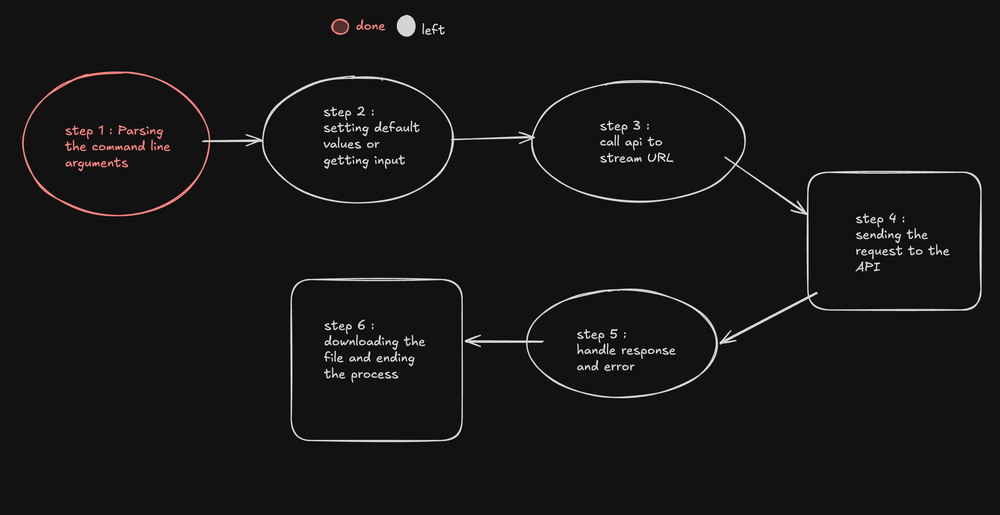

# TubeSaver - YouTube Video Downloader CLI

**TubeSaver** is a simple, command-line tool written in Rust for downloading YouTube videos in various formats, qualities, and audio-only options. The tool supports downloading with customizable settings such as quality, codec and path location .



---

## Features

- Download YouTube videos in multiple formats (video and audio).
- Choose video quality (e.g., 1080p, 720p, 480p, etc.).
- Select video codec (e.g., `h264`, `av1`, `vp9`).
- Download audio in multiple formats (`mp3`, `ogg`, `wav`, `opus`, etc.).
- Option to remove TikTok watermarks.
- Audio-only download mode with various format options.
- Debugging mode for troubleshooting.

## Installation

### Prerequisites

Before running the project, make sure you have **Rust** installed on your system.

To install Rust, you can follow the instructions from the official website: [Install Rust](https://www.rust-lang.org/tools/install).

### Clone the Repository

```bash
git clone https://github.com/yourusername/tubesaver.git
cd tubesaver
```

### Build the Project

Once the repository is cloned, navigate to the project directory and build it with Cargo:

```bash
cargo build --release
```

# Available Arguments

| Argument | Shorthand | Description | Default | Options |
| :--- | :--- | :--- | :--- | :--- |
| `--mode` | `-m` | Set the mode to download. | `auto` | `auto`, `audio` |
| `--path` | `-p` | Set the path to save the downloaded file. | `~/Downloads/` | |
| `--url` | `-u` | The URL of the YouTube video to download. | | |
| `--quality` | `-q` | Set the video quality. | `1080p` | `4320p+`, `2160p`, `1080p`, `720p`, `480p`, `360p` |
| `--codec` | `-c` | Set the video codec. | `h264` | `h264`, `av1`, `vp9` |
| `--audioformat` | `-f` | Set the audio format. | `mp3` | `mp3`, `best`, `ogg`, `wav`, `opus` |
| `--dublang` | `-d` | Use dub language. | `false` | |
| `--fullaudio` | `-k` | Download full audio. | `false` | |
| `--mute` | `-j` | Mute audio when possible. | `false` | |

---

With **TubeSaver**, you now have a simple and efficient tool to download and enjoy your favorite YouTube content offline. Whether you’re looking for the highest quality video or just the audio, TubeSaver makes it easy to get what you need. Enjoy the convenience and power of customizing your downloads to suit your preferences!

Give it a star ⭐️

---
